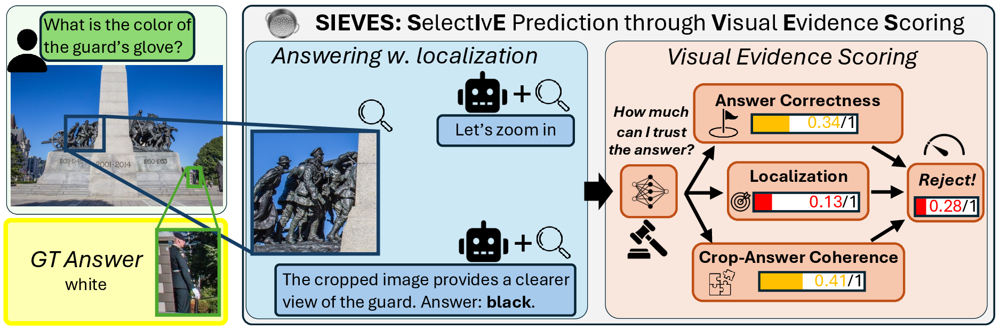
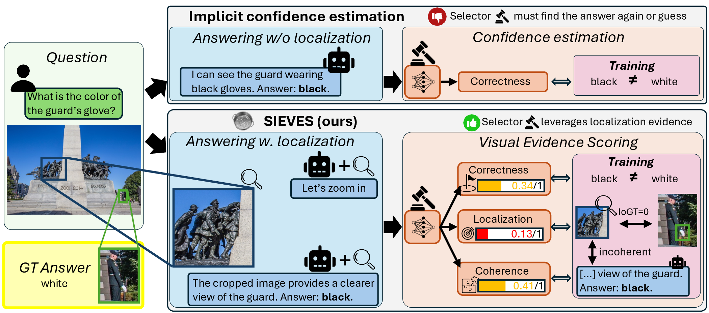
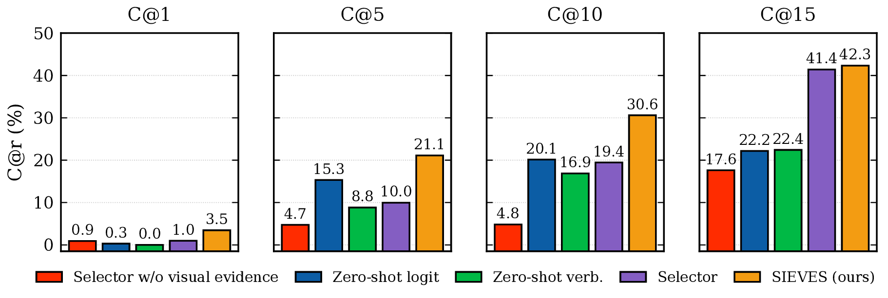
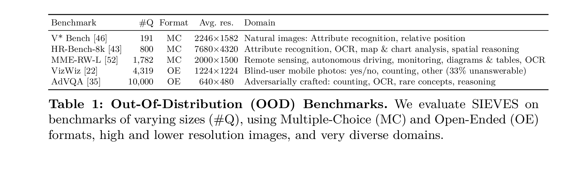
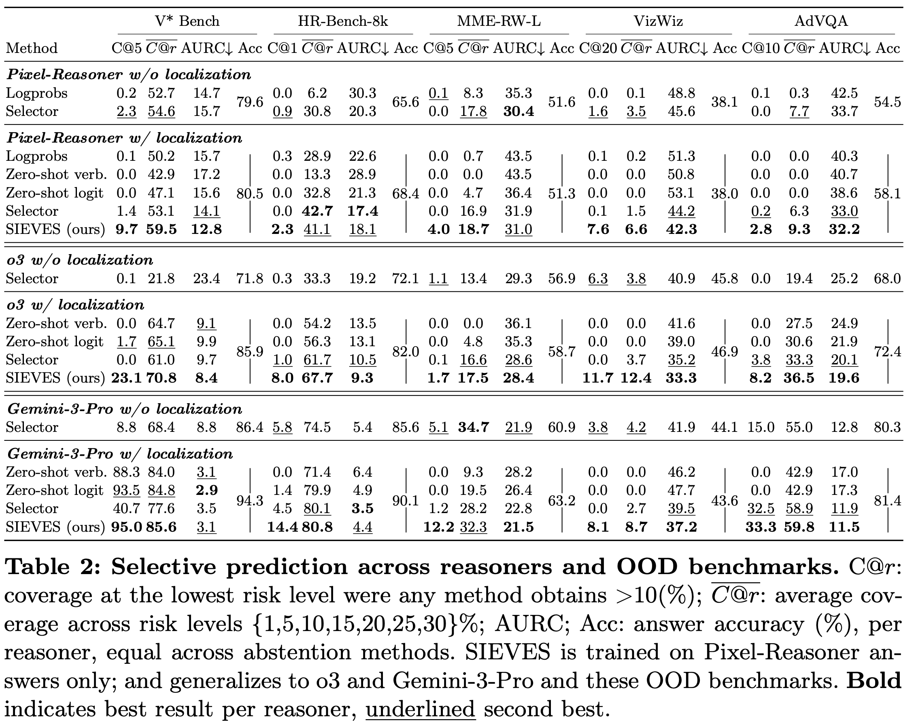
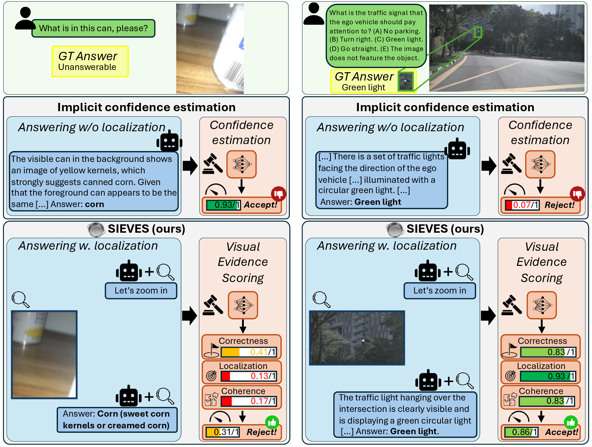

# SIEVES: Selective Prediction Generalizes through Visual Evidence Scoring

**[Hector G. Rodriguez](https://hector.gr), [Marcus Rohrbach](https://rohrbach.vision/)**

[](https://arxiv.org/abs/2604.25855)

---



## Overview

Multimodal large language models (MLLMs) achieve ever-stronger performance on visual-language tasks. Even as traditional VQA benchmarks approach saturation, reliable deployment requires satisfying low error tolerances in real-world out-of-distribution (OOD) scenarios. **Selective prediction** aims to improve *coverage* — the share of inputs the system answers — while adhering to a user-defined risk level. This is typically achieved by assigning a confidence score to each answer and abstaining on those that fall below a threshold.

## Method



SIEVES addresses the challenge of generalizing selective prediction to OOD settings. The key insight is that **localized visual evidence is a reliable signal for answer quality**: a model that correctly grounds its answer in the image is more likely to be right.

SIEVES has two components:

**Reasoner.** A tool-augmented vision-language model (e.g., Pixel-Reasoner, o3, Gemini-3-Pro) that answers the question *while zooming in on relevant image regions* to produce localized visual evidence.

**Selector.** A compact model trained to score the (question, image, reasoning, answer) tuple along three axes:
- *Correctness* ($c_{corr}$): is the final answer accurate?
- *Localization* ($c_{loc}$): did the model look at the right part of the image? Trained with intersection-over-ground-truth (IoGT) as supervision.
- *Coherence* ($c_{coh}$): does the zoomed-in visual evidence actually support the answer?

The three scores are combined into a single confidence $c_\text{sel}$. At inference, the system abstains whenever $c_\text{sel}$ falls below a threshold calibrated to a desired risk level. Because the selector operates on the reasoner's textual and visual outputs — not on its weights or logits — it **transfers directly to black-box proprietary models**.

## Results



SIEVES improves coverage by **up to 3×** on five OOD benchmarks compared to non-grounding baselines, and generalizes across all tested datasets and reasoner models without benchmark- or reasoner-specific tuning:





Transfer to proprietary reasoners (o3, Gemini-3-Pro) provides coverage boosts beyond those attributable to accuracy alone.

## Qualitative Examples



**Qualitative examples in high-stakes settings where SIEVES correctly abstains or accepts while an implicit selector fails.**
**Left:** On this high-stakes VizWiz question from a blind user, SIEVES correctly assigns low confidence to o3's answer for which the visual evidence points to a can in the background rather than the foreground, and where image clarity is low. The implicit confidence selector instead assigns very high confidence, even though the question is in fact unanswerable.
**Right:** On a high-stakes autonomous-driving task from MME-RealWorld-Lite, SIEVES assigns high localization and coherence scores and correctly accepts Gemini-3-Pro's answer because of high quality visual evidence. In contrast, the implicit confidence selector cannot identify the green light in the image and incorrectly rejects the correct answer.

---

> **Code coming soon.**

---

## Citation

If you find this work useful, please cite:

```bibtex
@misc{rodriguez2026sieves,
  title     = {SIEVES: Selective Prediction Generalizes through Visual Evidence Scoring},
  author    = {Hector G. Rodriguez and Marcus Rohrbach},
  year      = {2026},
  eprint    = {2604.25855},
  archivePrefix = {arXiv},
  primaryClass  = {cs.CV},
  url       = {https://arxiv.org/abs/2604.25855}
}
```
